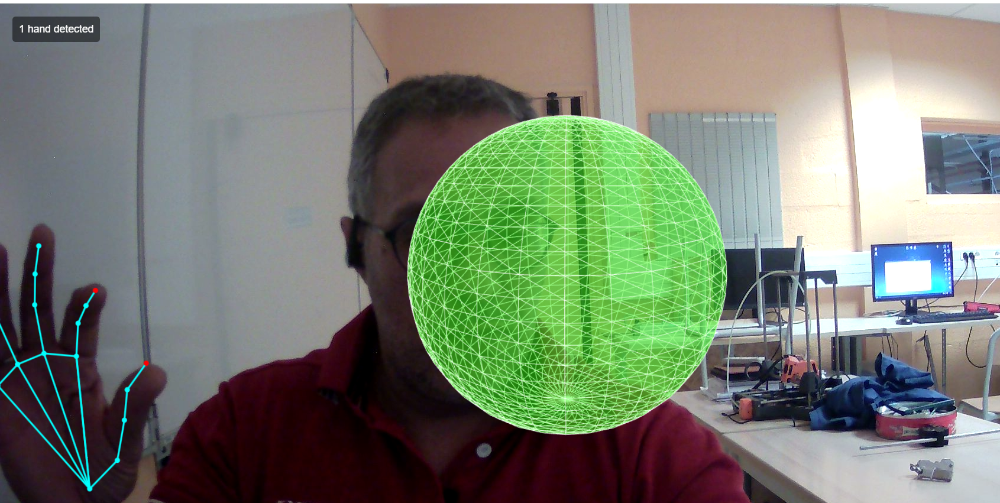

# 3D Hand Tracking Demo

A threejs / WebGL / MediaPipe-powered interactive demo that allows you to control a 3D sphere using hand gestures.



## Demo

Try the live demo: [https://guarim.github.io/threejs-controle-mains/](https://guarim.github.io/threejs-controle-mains/)

## Features

- **Real-time hand tracking** using MediaPipe Hands
- **Left hand gesture control:** Pinch thumb and index finger to resize the 3D sphere
- **Right hand interaction:** Touch the sphere with your index finger to change its color
- **Responsive design** that works on desktop and mobile browsers
- **Visual feedback** with color-coded hand tracking

## Requirements

- Modern web browser with WebGL support
- Camera access
- No additional software or downloads needed

## Technologies

- **Three.js** for 3D rendering
- **MediaPipe** for hand tracking and gesture recognition
- **HTML5 Canvas** for visual feedback
- **JavaScript** for real-time interaction

## Setup for Development

```bash
# Clone this repository
git clone https://github.com/collidingScopes/threejs-handtracking-101

# Navigate to the project directory
cd threejs-handtracking-101

# Serve with your preferred method (example using Python)
python -m http.server
```

Then navigate to `http://localhost:8000` in your browser.

## License

MIT License

## Credits

- Three.js - https://threejs.org/
- MediaPipe - https://mediapipe.dev/

## Related Projects

Check out other free and open-source projects by the same developer:

- [Particular Drift](https://collidingScopes.github.io/particular-drift) - Turn photos into flowing particle animations
- [Liquid Logo](https://collidingScopes.github.io/liquid-logo) - Transform logos and icons into liquid metal animations
- [Video-to-ASCII](https://collidingScopes.github.io/ascii) - Convert videos into ASCII pixel art
- [Shape Shimmer](https://collidingScopes.github.io/shimmer) - Turn photos into funky wave animations
- [Colliding Scopes](https://collidingScopes.github.io) - Turn photos into kaleidoscope animations
- [Manual Brick Breaker](https://manual-brick-breaker.netlify.app) - Play brick breaker by waving your hands around

## Contact

- Instagram: [@stereo.drift](https://www.instagram.com/stereo.drift/)
- Twitter/X: [@measure_plan](https://x.com/measure_plan)
- Email: [stereodriftvisuals@gmail.com](mailto:stereodriftvisuals@gmail.com)
- GitHub: [collidingScopes](https://github.com/collidingScopes)

